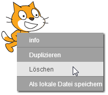
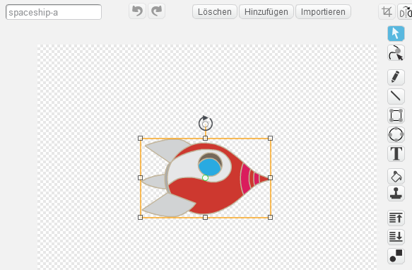
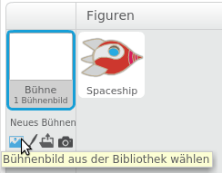
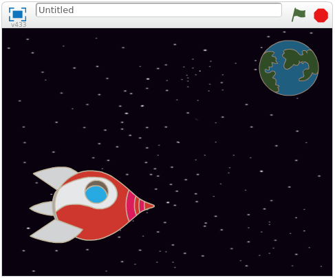
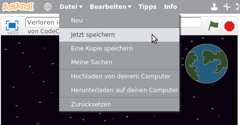

## Figuren

+ Zuerst musst du sicherstellen, dass du Scratch geöffnet hast. Den online Scratch-Editor findest du auf <a href="http://jumpto.cc/scratch-new">jumpto.cc/scratch-new</a>. Es sollte ungefähr so aussehen:

	

+ Bevor du eine Animation anfangen kannst, musst du zuerst ein „Ding“ einfügen, das animiert werden soll. In Scratch werden diese „Dinge“ als „Figuren“ bezeichnet. Die Katze, die du siehst, ist eine Figur namens Felix, das Maskottchen von Scratch. Lass sie uns löschen, indem wir mit der rechten Maustaste auf die Katze klicken und „Löschen“ wählen.

	

+ Klicke als nächstes auf „Figur aus der Bibliothek wählen“, um eine Liste von allen Figuren zu sehen, die uns in Scratch zur Verfügung stehen.

	

+ Scrolle runter, bis du eine Figur in der Form eines Raumschiffes findest. Klicke auf das Raumschiff, um es zu deiner Animation hinzuzufügen.

	

+ Klicke auf die Raumschiff-Figur, und dann auf „Kostüme“.

	

+ Benutze das Pfeil-Werkzeug, um das ganze Bild auszuwählen. Ziehe dann an dem Griff über dem Bild, um es zu drehen, bis es auf der Seite liegt.

	

+ Du solltest jetzt ein großes Raumschiff auf deiner „Bühne“ sehen. Die „Bühne“ ist der Bereich auf der linken Seite, in dem deine Animation ablaufen wird. Stell dir vor, es wäre eine echte Theaterbühne! Du kannst das Raumschiff auf der Bühne hin- und herziehen, um es zu verschieben.

	Im Augenblick ist die Bühne weiss und sieht ziemlich langweilig aus! Lass uns einen Hintergrund hinzufügen, indem du auf das Symbol „Bühne“ klickst, und dann auf „Bühnenbild aus der Bibliothek wählen“.

	

+ Klicke auf der linken Seite auf „Weltraum“, dann auf den „Stars“-Hintergrund und dann auf „OK“, um deiner Bühne dieses Hintergrundbild zu geben.

	

	Deine Bühne sollte jetzt so aussehen:

	

--- challenge ---
## Herausforderung: Füge eine weitere Figur hinzu 
Kannst du noch eine Figur zu deiner Bühne hinzuzufügen, damit es so aussieht? (Die Erde heißt „Earth“ in der Figurenbibliothek.)

--- /challenge ---

Du solltest deine Arbeit regelmäßig abspeichern, damit sie nicht verloren geht. Gib zuerst deinem Programm einen Titel, indem du einen Namen in das Textfeld über der Bühne eintippst. Danach kannst du auf „Datei“ und dann auf „Jetzt speichern“ klicken.

Wenn du Scratch online benutzt, wird deine Arbeit in den Ordner „Sachen“ hinzugefügt, wenn du auf „Speichern“ klickst. Das ist ein Online-Ordner, auf den du von überall zugreifen kannst, sogar von zu Hause aus. Du kannst auf deine „Sachen“ zugreifen, indem du auf „Datei“, und dann auf „Meine Sachen“ klickst.

Hier findest du eine Liste von all deinen Projekten. Klicke auf „Schau hinein“, um deine Animation weiter zu bearbeiten.

Wenn du Scratch online benutzt, aber keinen Benutzernamen hast, dann kannst du auf „Herunterladen auf deinen Computer“ klicken, um dein Projekt dort abzuspeichern.
