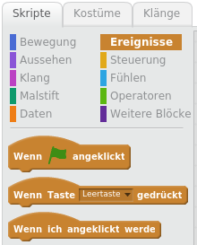

## Deine Figuren animieren

Jetzt, da du ein paar Figuren hast, lass uns Code hinzufügen, um sie zu animieren!

+ Wir werden ein Skript für das Raumschiff erstellen, indem wir „Code-Bausteine“ benutzen, die wir von jetzt an „Blöcke“ nennen. Diese Code-Blöcke findest du im Bereich „Skripte“, und sie haben unterschiedliche Farben. Ziehe die 2 folgenden Blöcke in den Bereich „Skripte“ auf der rechten Seite und stelle sicher, dass sie verbunden sind (ähnlich wie bei Lego-Bausteinen).

	

	Ändere die Nummern der Code-Blöcke, so dass der Code genau der gleiche ist wie im Bild oben. Diesen Code solltest du hinzufügen:

	```blocks
		drehe dich zu [Earth v]
		gleite in (1) Sek. zu x:(0) y:(0)
	```

	Um den Block `drehe dich zu Earth`{:class="blockmotion"} zu erstellen, musst du auf deinen Block klicken und dann auf den nach unten zeigenden Pfeil, um deine „Earth“-Figur auszuwählen.

	

+ Wenn du jetzt auf deine Code-Blöcke klickst, um deinen Code auszuprobieren, solltest du sehen, wie das Raumschiff sich in Richtung der Mitte der Bühne bewegt.

	

	Die Bildschirmposition `x:(0) y:(0)`{:class="blockmotion"} entspricht der Mitte der Bühne. Eine Position wie etwa `x:(-150) y:(-150)`{:class="blockmotion"} befindet sich am unteren linken Teil der Bühne, und eine Position wie `x:(150) y:(150)`{:class="blockmotion"} ist eher oben rechts.

	

	Wenn du die Koordinaten einer Position auf dem der Bühne wissen möchtest, kannst du mit deiner Maus zu dieser Position hingehen und dann die Koordinaten aufschreiben, die unter der Bühne angezeigt werden.

	

+ Wenn du nochmals versuchst auf deinen Code-Block zu klicken, dann geschieht nichts! Das ist deshalb, weil dein Raumschiff bereits auf der Zielposition steht. Wir werden deine Animation verbessern, indem wir dem Raumschiff sagen, dass es unten links auf der Bühne starten und nach oben zeigen soll.

+ Füge noch ein paar Blöcke zu deiner Animation hinzu, zusätzlich zu den Blöcken, die du bereits hast. Dein Code sollte jetzt so aussehen:

	```blocks
		setze Richtung auf (0 v)
		gehe zu x:(-150) y:(-150)
		warte (1) Sek.
		drehe dich zu [Earth v]
		gleite in (1) Sek. zu x:(0) y:(0)
	```

	Den Block `warte (1) Sek.`{:class="blockcontrol"} findest du im organgefarbenen Bereich der Blöcke unter `Steuerung`{:class="blockcontrol"}.

+ Dein Raumschiff bewegt sicht jetzt _jedes Mal,_ wenn du deinen Code startest. Versuch es!

+ Du kannst deinen Animationscode auch von einem „Ereignis“ abhängig machen. Das bedeutet, dass dein Code jedes Mal starten wird, wenn ein bestimmtes Ereignis vorkommt. Zum Beispiel wenn die grüne Flagge angeklickt wird, wenn eine Taste gedrückt wird oder wenn eine Figur angeklickt wird.

	

	Ziehe ein „Ereignis“ an den Anfang des Codes, so dass deine Animation startet, wenn die grüne Flagge angeklickt wird. Dein Code sollte so aussehen:

	```blocks
		Wenn die grüne Flagge angeklickt
		setze Richtung auf (0 v)
		gehe zu x:(-150) y:(-150)
		warte (1) Sek.
		drehe dich zu [Earth v]
		gleite in (1) Sek. zu x:(0) y:(0)
	```

+ Versuche deine Animation mehrmals durchzuführen, indem du auf die grüne Flagge über der Bühne klickst.

	

--- challenge ---
	
## Herausforderung: Deine Animation verbessern
Kannst du die Zahlen im Animationscode so ändern, so dass:
+ das Raumschiff sich bewegt, bis es die Erde berührt?
+ das Raumschiff sich langsamer bewegt?

Du musst die Zahlen in diesem Block ändern:

```blocks
	gleite in (1) Sek. zu x:(0) y:(0)
```

--- /challenge ---
